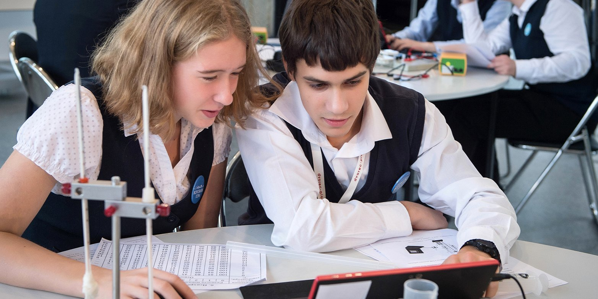

#  Outdoor Machine Learning School

## Introduction :tada:

Machine learning task are widely spreaded among business, goverment and healthcare tasks. Nowdays we plan our actions according to statistical data and it's essential to extract as much information from incoming data as possible

Modern state-of-the-art AI algorithms proved to be efficient and already helps millions of people.

Diffusion models are capable of generating fascinating images relevant to promts of any willer :art:

Reinforcement learning algorithms beats human in Go and Chess :muscle:

Speech synthesis in Moscow support service allows to help more people by automatic response :telephone_receiver:

Current school goal is to involve perspective young students in AI community. Help them to take first steps in building their career perspectives.

## Target audience

100 students  :sunglasses: of the 10th-11th grade of Moscow schools

### Benefits 

- median salary of junior ai developer is 1500$ :moneybag:
- challenging tasks :eyeglasses:
- rapidly growing allows rapid proffesional growth :chart_with_upwards_trend:

## Qualifying rounds

Pupils who will apply to the programm will be guided two tests:
- basic math and python knowledge
- basic and advance group

## Channels of attraction
- VK advertisment
- Habr article
- School attendant and posters

 

## Thematical events

The main goal of activty is to involve audience in AI community. We will follow onboarding practises of current most prestigious IT company like Sber, Tinkoff and Yandex. 

- Basics of SQL
- Python: pandas and SkLearn
- Linear models
- Classical business cases: insurance, trading and defolt predictiion 
- Current state-of-the-art 

## Rules

- No alchohol :wine_glass: and smoking :smoking:
- Weather-appropriate clothes :tophat: :closed_umbrella: :dress:

## Plan

Each day will be thematicaly organised

- How we store and work with data
    - tabular data
    - pandas
    - pivot tables
- How we visualize data 
    - graphs
    - diagrams
    - presentation
- How we predict future 
    -  person profile
    - regression & classification
    - linear models

### Basic daily routine:
- 7:30 - 8:30 - Wake up and morning routines :scream_cat:
- 8:30 - 9:00 - Breakfast :egg:
- 9:00 - 10:00 - Daily plan announcement, theme introduction :hotel:
- 10:00 - 14:00 - Lectures and seminars :sunglasses:
- 14:00 - 15:00 - Dinner :rice:
- 15:00 - 16:30 - Outdoors activity :soccer:
- 16:30 - 18:30 - Championship :mount_fuji:
- 18:30 - 19:00  - Results announcement and reward :trophy:
- 19:00 - 19:30 - Supper :apple:
- 19:30 - 22:00 -  Evening acitvity :dart:
- 22:00 - 23:00 - Bedtime :zzz:

## Financial plan

MPV:
- educational programm cost:
    - tasks and mainly free)
    - comptetion
- transport costs:
    - bus: 1e5
    - parent allocation: free
- estate rent costs:
    - rooms:  1e6
    - food: 1e5
    - conference hall and seminars: 1e6
- laptops rent: 1e5
- merch costs ? it-colab
  - t-shirts: 1e4
  - rucksack: 1e4
- recruitment costs:
    - volunters: room & food costs & merch : 1e5
S
Total: 2.5e6 rub

## Probable time realization

Event start time: 15 october (autumn vacation)

- planning: 1 month
- visit-site development: 2 weeks
- finding volunters and students: 2 month (summer vacation start)
- finding hotel and organization: 1 month

