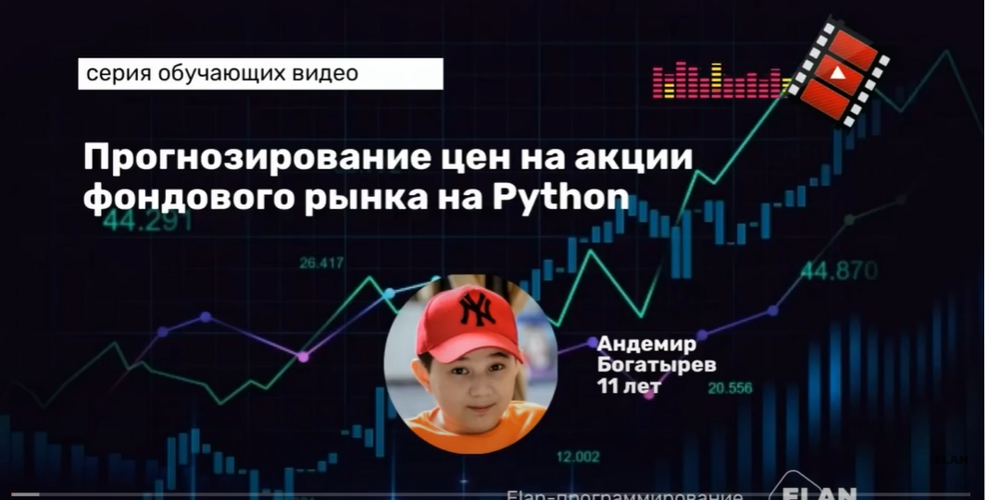

# **Школа машинного обучения**

---
**План**
- мотивация проекта
- целевая аудитория 
- план пилота
- ресурсы

---
**Задачи будущего**

---
**Инфраструктура города**

---
**Гибкие финансовы инструменты**

---

**Творчество**

---

**Профессии будущего**
- разработчики
- аналитики
- дизайнеры
- технологи
---

# Наша задача познакомить ребят и учителей с современнными проффесиями

---

**Тема смены - необанк**

---

**Учащиеся будут разделены на четыре команды** 

- веб-разработка
- продуктовый аналитикf
- риск-аналитика
- разработка хранилищ данных

---

**Результаты работы каждого дня будем соединять в единный проект**

---

## Обучаем не только детей, но и учителей!

---

**Каждое направление будет курироваться учителем**
- будем обучать учителей лидерским навыком
- потребностям совренных работодателей

---

**Отбор**

- 5 учеников 10-11 класс на направление
- 4 учителя на проект
- тестовое задание + собеседование для учителя на направление
- учителя сами выбирают команду

---

**Ресурсы**

- оплата занятий 5 специалистов из индустрии ~ 20 к/день
- ноутбуки
- классные команты
- питание

---
# План смены

---

**3 дня на создание продукта**

- минимальная реализация
- работа над ошибками
- презентация проекта

---

**Расписание**

- 10:00 - 13:00 - предметные семинары
- 13:00 - 14:00 - обед
- 14:00 - 14:30 - брейнштром
- 14:30 - 17:00 - работа над задачей
- 17:00 - 17:30 - ужин
- 17:30 - 18:00 - итоги дня

---

**Финальный день**
- презентация результатов работы каждой из команд
- подводим итоги
- кофе-брейк для обмена контактами

---
**Трек: риск-аналитикиа**

---

**Что будем проходить?**

- оценка рисков
- скоринг
- источники информации
- статистические методы

---
**Формат**
- введение в тему - презентация + доска
- решение задачи на комбинаторику у доски
- работа с датасетами на ноутбуке

---

**Это возможно!**

> https://www.youtube.com/watch?v=F9ZIOtEfIm0
---

**Итоги**
- 4 дневная смена
- 20 детей + 4 учителя
- обучаем детей и учителей создавать it-продукт
- бюджет укладывается в 80к рублей + инфраструктура школы
- получаем крутой проект в портфолио школы и учеников
  

---

# Cпасибо за внимание!